# LED Defects Detection: Journal

This journal contains the development process of the LED defects detection project. The project aims to detect defects in LEDs using the YOLO family of models. The dataset preparation is tailored for YOLO training, and training/testing is performed using the YOLO framework.

## Questions

- What are the ***general goals*** of the project?
  - Inference time? Hardware constraints?
  - Incrementally adding new types of defects?
- Unsupervised learning?
  - Object detection (YOLO) vs. Anomaly detection
    - Supervised learning vs. Unsupervised learning
    - Mastering special case vs. Mastering normal samples
  - After a bit [survey](https://arxiv.org/abs/2401.16402), it seems the unsupervised learning approach on AD is more and more popular? (like reconstruction-based approach)
    <div style="display: flex; justify-content: center;">
      
    </div>
  - If unsupervised learning is feasible, could it be ***more practical than supervised continuous learning?***
- How can we improve the dataset?
  - More samples?
  - More capturing angles?
  - Improve annotations?
- References:
  - [A Unified Anomaly Synthesis Strategy with Gradient Ascent for Industrial Anomaly Detection and Localization](https://arxiv.org/abs/2407.09359) (2024)
    - A very SOTA approach for data augmentation for anomaly detection.
  - [WinCLIP: Zero-/Few-Shot Anomaly Classification and Segmentation](https://arxiv.org/abs/2303.14814) (2023)
    - A interesting approach for zero-shot anomaly detection.
  - [EfficientAD: Accurate Visual Anomaly Detection at Millisecond-Level Latencies](https://arxiv.org/abs/2303.14535) (2023)
    - An ultra fast yet accurate anomaly detection approach.
  - [Towards Total Recall in Industrial Anomaly Detection](https://arxiv.org/abs/2106.08265)
    - An old but popular (cited 791) paper on anomaly detection.
  - [AnoDDPM: Anomaly Detection with Denoising Diffusion Probabilistic Models using Simplex Noise](https://openaccess.thecvf.com/content/CVPR2022W/NTIRE/papers/Wyatt_AnoDDPM_Anomaly_Detection_With_Denoising_Diffusion_Probabilistic_Models_Using_Simplex_CVPRW_2022_paper.pdf)
    - Diffusion, reconstruction-based approach.
    - Follow-up: [Anomaly Detection with Conditioned Denoising Diffusion Models](https://arxiv.org/abs/2305.15956)
  - Survey: [A Survey on Visual Anomaly Detection: Challenge, Approach, and Prospect](https://arxiv.org/abs/2401.16402) (2024)
  - Very useful library: [openvinotoolkit/anomalib](https://github.com/openvinotoolkit/anomalib.git)
  - Benchmark: [Anomaly Detection on MVTec AD](https://paperswithcode.com/sota/anomaly-detection-on-mvtec-ad)

## Experiments - Ultralytics (YOLO Family)

This section contains the results of the experiments conducted during the development of this project. GitHub commits are provided for each experiment to ensure reproducibility.

### Model Sweep

**GitHub Commit**: [3fd972925ad585b568fb641629f41f9b4e2537e9](https://github.com/agbld/led-defects-detection/commit/3fd972925ad585b568fb641629f41f9b4e2537e9)

#### Objective
- Find the best model for current dataset.

#### Method
- Use only those "major" classes that have enough samples to eliminate the data insufficiency problem. Which are: `led`, `particle`, `flip`, `Particle_Big`, `marked`.
- Tested models:
  - `yolov5xu (97.2M)`
  - `yolov8x (68.2M)`
  - `yolov9e (58.1M)`
  - `yolov10x (29.5M)`
  - `yolo11x (56.9M)`

#### Results
- Performance table:
  
- According to precision, recall, mAPs, all tested models have **similar performance**.
- Later models (*yolov9e*, *yolov10x*, *yolo11x*) have very slightly better performance than older models (*yolov5xu*, *yolov8x*).
- Confusion matrix (yolo11x):
  <div style="display: flex; justify-content: space-around;">
    
    
  </div>

### Class Sweep

**GitHub Commit**: [cd675400b8f78e49c93cddb925846edf51a1ab2f](https://github.com/agbld/led-defects-detection/commit/cd675400b8f78e49c93cddb925846edf51a1ab2f)

**GitHub Commit** (train as val version): [c5e92f94a4f5aa7e37484644ab43decf5d017e3e](https://github.com/agbld/led-defects-detection/commit/c5e92f94a4f5aa7e37484644ab43decf5d017e3e)

#### Objective
- An ablation study or an EDA to observe each class training outcomes.
- See the upper bound performance of the model for each class.

#### Method
- Train the model with each class separately. Specifically, use `prepare_dataset.py` to prepare a dataset for each class. Then, train the model with `main.py` for each class.
- Use `yolo11x` model for all experiments.
- Use `--epochs 500` to ensure convergence.

#### Results
- Labels distribution <br>
    <div style="display: flex; justify-content: center;">
      
    </div>

- Label "information" <br>
  `led` and `marked` classes have the most samples. However, consider the "information" we get from annotations, `led` and `marked` classes, especially the `marked` class has almost no information. From the following figures, we can see the shape and position of it almost never changes. Things are similar for the `led` class (but not as severe as `marked`).
  <div style="display: flex; justify-content: space-around;">
    
    
  </div>

- Label "information" (continued) <br>
  On the other hand, `particle`, `Particle_Big` and `flip` have MUCH more "information". See following figures:
  <div style="display: flex; justify-content: space-around;">
    
    
    
  </div>

- Insufficient data <br>
  For the last two classes, `tilt` and `led_ng`, we have very few samples (< 10). This also leads to the stability problem during training. See the following figures:
    <div style="display: flex; justify-content: center;">
      
    </div>

- Metrics <br>
  According to the following figures, we can see that YOLO could fit very well on `led`, `marked`, and `flip` classes (assuming `led` and `marked` are necessary). The `Particle_Big` has good convergence. The `particle` couldn't go better after around 120 epochs. Since we have more sample for `particle` than `Particle_Big`, the underfitting might be due to the labeling quality (eg. defect definition).
  <div style="display: flex; justify-content: space-around;">
    
    
  </div><br>

- **Conclusion** <br>
  - `led` and `marked` classes have almost no information. Consider removing them.
  - `particle`, `Particle_Big` and `flip` classes have much more information. However, the `particle` has problems on convergence. Require further error analysis (or more patience).
  - `tilt` and `led_ng` classes have insufficient data. Consider getting more samples or removing them.

### Training as Validation

**GitHub Commit**: N/A

#### Objective
- Use the training set as the validation set to see is there any unreasonable labelings that model couldn't even overfit.
- This is just a very ir-rigorous sanity check. If model could find any minor patterns to identify each specific sample, it should be able to overfit the training set.

#### Method
- Use the training set as the validation set. Specifically, copy the path of training set from `data.yaml` to the validation set.
- Use `yolo11x` model, `--epochs 100`.

#### Results
- Confusion matrix <br>
  <div style="display: flex; justify-content: space-around;">
    
    
  </div>
- Most of the classes seem to be learned well.

### Particle Error Analysis

**GitHub Commit**: N/A

#### Objective

- Investigate how the model performs on the `particle` class.

#### Method
- Use the `inference.py` script to visualize error samples on the `particle` class.
- Use 1) the best checkpoint so far on major classes (`major-cls-yolo11x`), 2) the best checkpoint for `particle` class in train-as-val experiment (`train-as-val-particle`).

#### Results
- Error occured when the granularity that model learned is not aligned with ground truth. 
- Plus, some of the samples seem to be mislabeled.
- See the following figures:
  <div style="display: flex; justify-content: space-around; flex-wrap: wrap;">
    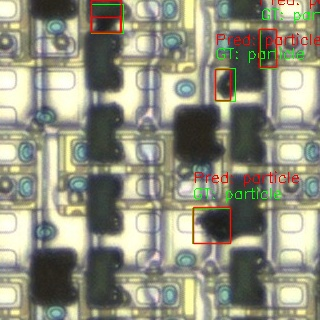
    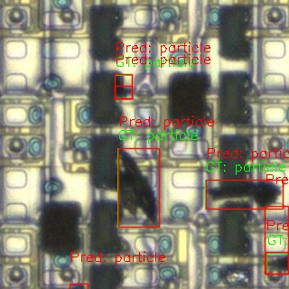
    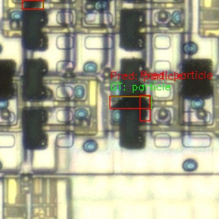
  </div><br>
  <div style="display: flex; justify-content: space-around; flex-wrap: wrap;">
    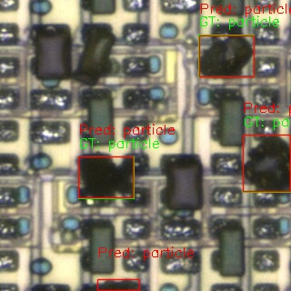
    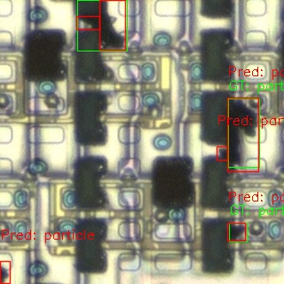
    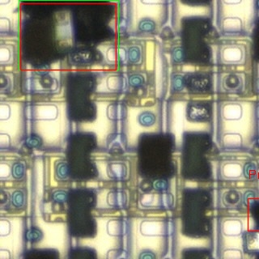
  </div>
- The above samples are from the `train-as-val-particle`. This shows that, with sufficient data, the model could learn the `particle` class well.

## Experiments - EfficientAD

After doing EDA with YOLO, the unsupervised learning approach is considered. The EfficientAD approach is chosen for its ultra-fast inference time. See fur

### EfficientAD vs. YOLOv11x

#### EfficientAD

* Training completed in **52 seconds**
* Inference completed in 5 seconds (< 10ms per image)
* (See [It Even Finds Many Mislabeled Samples](#it-even-finds-many-mislabeled-samples) for poor performance for `good` class)
```bash
(led) ee303@ee303-Z790-AORUS-ELITE:~/Documents/agbld/GitHub/led-defects-detection/efficientad$ python train.py --dataset custom --custom_dataset_path efficientad_dataset --output_dir output/1 --model_size small --epochs 10 --batch_size 10
Computing mean of features: 100%|█████████████████████████████████████████████████████████████████████████████████████████████| 70/70 [00:00<00:00, 90.79it/s]
Computing std of features: 100%|█████████████████████████████████████████████████████████████████████████████████████████████| 70/70 [00:00<00:00, 114.32it/s]
Epoch: 10/10 - Iteration: 61/70 - Current loss: 5.2889: 100%|█████████████████████████████████████████████████████████████████| 10/10 [00:56<00:00,  5.61s/it]
Final map normalization: 100%|██████████████████████████████████████████████████████████████████████████████████████████████████| 8/8 [00:00<00:00, 23.32it/s]
(led) ee303@ee303-Z790-AORUS-ELITE:~/Documents/agbld/GitHub/led-defects-detection/efficientad$ python eval.py --dataset custom --custom_dataset_path efficientad_dataset --output_dir output/1 --model_size small --map_format jpg --threshold 15 --weights_dir output/1/trainings/custom
Final inference: 100%|█████████████████████████████████████████████████████████████████████████████████████████████████████| 543/543 [00:03<00:00, 153.74it/s]

Class            Accuracy    Precision    Recall    Num Samples
-------------  ----------  -----------  --------  -------------
defect_type_2      1.0000       1.0000    1.0000            112
defect_type_3      1.0000       1.0000    1.0000             87
defect_type_4      1.0000       1.0000    1.0000            134
defect_type_6      1.0000       1.0000    1.0000              6
defect_type_7      1.0000       1.0000    1.0000             10
good               0.8505       1.0000    0.8505            194

Class      Accuracy    Precision    Recall    Num Samples
-------  ----------  -----------  --------  -------------
Overall      0.9466       0.9233    1.0000            543
Final image AUC: 98.5636
```

#### YOLOv11x Under Similar Settings

* Training completed in **741 seconds**
* Inference completed in **2 seconds** (< 10ms per image)
```bash
Processing images: 100%|████████████████████████████████████████████████████████████████████████| 229/229 [00:02<00:00, 112.13it/s]

Overall Metrics:
Accuracy: 0.8734
Precision: 0.7527
Recall: 0.9211
AUC: 0.9383

Class            Accuracy    Precision    Recall    Num Samples
-------------  ----------  -----------  --------  -------------
defect_type_2      0.9200       1.0000    0.9200             25
defect_type_3      1.0000       1.0000    1.0000             19
defect_type_4      0.8621       1.0000    0.8621             29
defect_type_6      1.0000       1.0000    1.0000              1
defect_type_7      1.0000       1.0000    1.0000              2
good               0.8497       0.0000    0.0000            153
```

### Case Study

#### Good Samples (Normal)

<table>
    <tr>
        <td>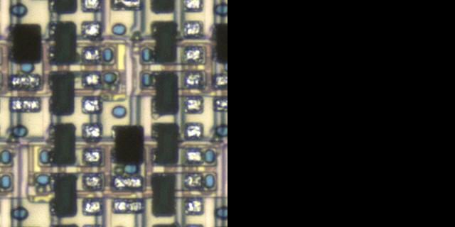<br /><center>Good 1</center></td>
        <td>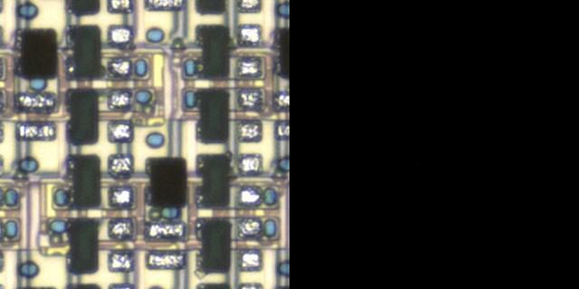<br /><center>Good 2</center></td>
        <td>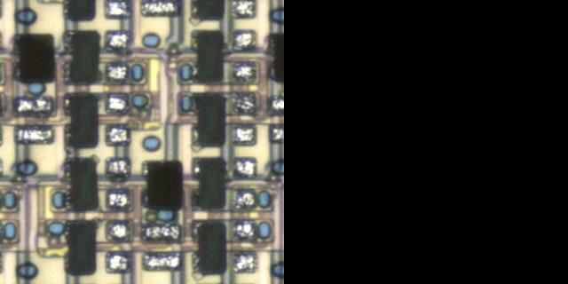<br /><center>Good 3</center></td>
    </tr>
</table>

#### Defect Samples (Anomalies)

<table>
    <tr>
        <td>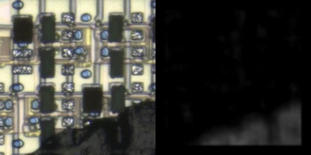<br /><center>Particle Big 1</center></td>
        <td>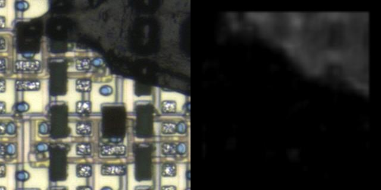<br /><center>Particle Big 2</center></td>
    </tr>
</table>
<table>
    <tr>
        <td>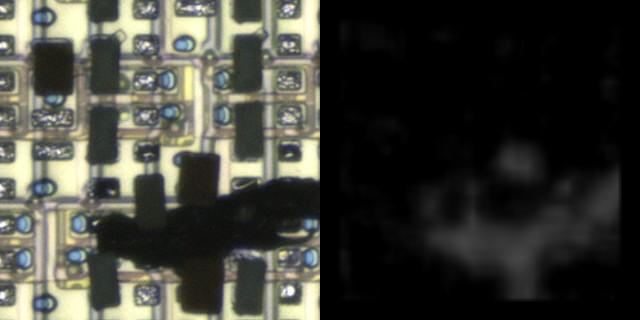<br /><center>Particle 1</center></td>
        <td><br /><center>Particle 2</center></td>
    </tr>
</table>
<table>
    <tr>
        <td>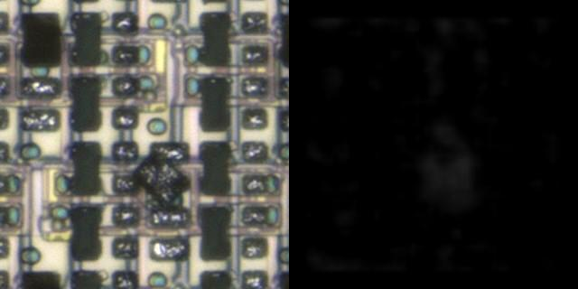<br /><center>LED NG 1</center></td>
        <td>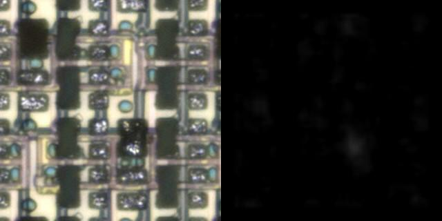<br /><center>LED NG 2</center></td>
    </tr>
</table>
<table>
    <td>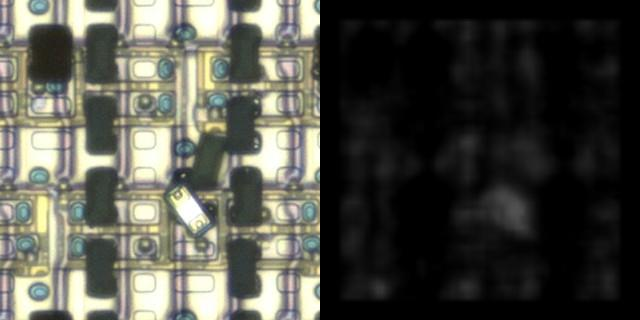<br /><center>Flip 1</center></td>
    <td>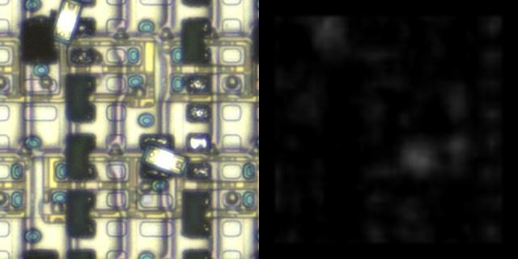<br /><center>Flip 2</center></td>
    <td>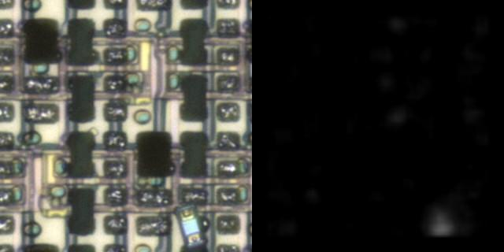<br /><center>Flip 3</center></td>
    </tr>
</table>
<table>
    <td>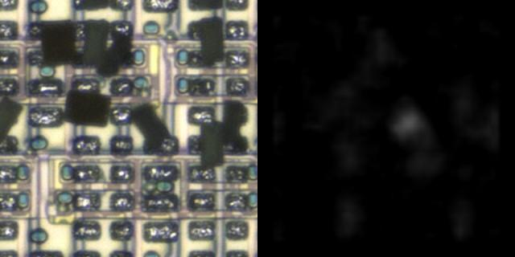<br /><center>Tilt 1</center></td>
    <td>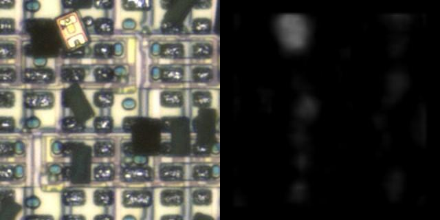<br /><center>Tilt 2</center></td>
    <td>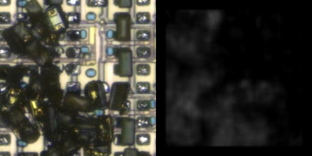<br /><center>...</center></td>
    </tr>
</table>

#### It Even Finds Many Mislabeled Samples

There're MUCH MORE mislabeled samples in the dataset. I just show a few of them here.

<table>
    <tr>
        <td>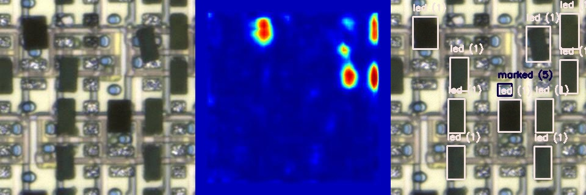<br /><center>Mislabeled 1</center></td>
        <td>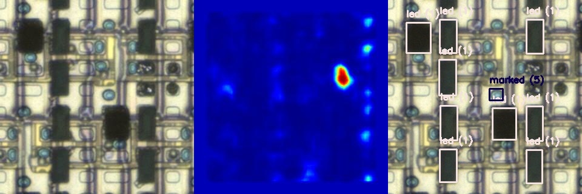<br /><center>Mislabeled 2</center></td>
    </tr>
    <tr>
        <td>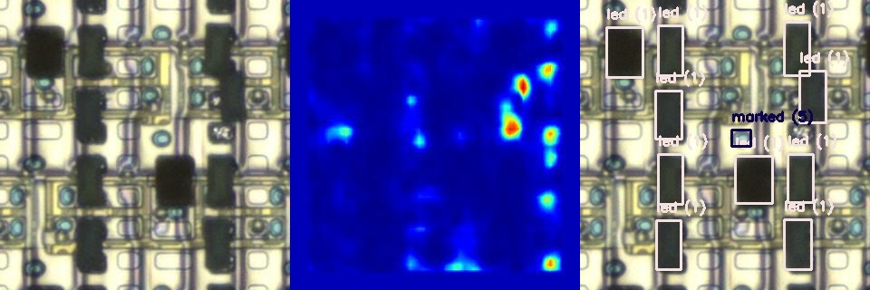<br /><center>Mislabeled 3</center></td>
        <td>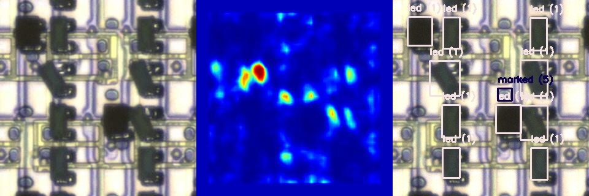<br /><center>Mislabeled 4</center></td>
    </tr>
</table>