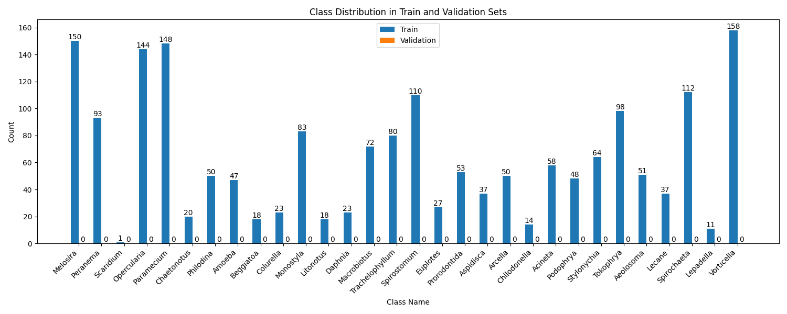
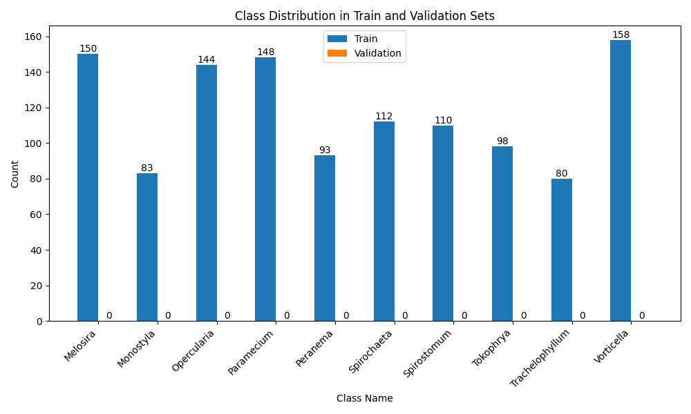

## Dataset Preparation

Class distribution of original dataset:


For easier observation, the top 10 major classes are chosen for further experiments:


<div style="page-break-after: always;"></div>
The ID to class name mapping is as follows:

| ID (defect_type) | Class Name       | Count |
|-----------|------------------|-------|
| 1         | Melosira         | 150   |
| 2         | Monostyla        | 83    |
| 3         | Opercularia      | 144   |
| 4         | Paramecium       | 148   |
| 5         | Peranema         | 93    |
| 6         | Spirochaeta      | 112   |
| 7         | Spirostomum      | 110   |
| 8         | Tokophrya        | 98    |
| 9         | Trachelophyllum  | 80    |
| 10        | Vorticella       | 158   |

The first class *Melosira* was chosen as the "normal" sample for the anomaly detection task. The rest of the classes are considered as anomalies. The resulting dataset for anomaly detection is as follows:

| defect_type   | Class Name       | Count |
|---------------|------------------|-------|
| good          | Melosira         | 150   |
| defect_type_2 | Monostyla        | 83    |
| defect_type_3 | Opercularia      | 144   |
| defect_type_4 | Paramecium       | 148   |
| defect_type_5 | Peranema         | 93    |
| defect_type_6 | Spirochaeta      | 112   |
| defect_type_7 | Spirostomum      | 110   |
| defect_type_8 | Tokophrya        | 98    |
| defect_type_9 | Trachelophyllum  | 80    |
| defect_type_10| Vorticella       | 158   |


<div style="page-break-after: always;"></div>

The splited dataset is as follows:
| directory                          | count |
|------------------------------------|-------|
| efficientad_dataset\train\good     | 66    |
| efficientad_dataset\test\good      | 17    |
| efficientad_dataset\test\defect_type_2 | 61    |
| efficientad_dataset\test\defect_type_3 | 56    |
| efficientad_dataset\test\defect_type_4 | 58    |
| efficientad_dataset\test\defect_type_5 | 52    |
| efficientad_dataset\test\defect_type_6 | 37    |
| efficientad_dataset\test\defect_type_7 | 43    |
| efficientad_dataset\test\defect_type_8 | 42    |
| efficientad_dataset\test\defect_type_9 | 44    |
| efficientad_dataset\test\defect_type_10| 79    |

Finally, the dataset was prepared using the following command:
```bash
python prepare_dataset.py --annotations ../data/original-top10/annotations/instance.json --labeled_dir ../data/original-top10/images/ --unlabeled_dir ../data/original-top10/normal/B/ --output_dir efficientad_dataset --train_ratio 0.8 --ignore_defects 1
```

Highlights of configuration:
- Train ratio: 0.8
- Ignored defects: 1 (Melosira)

## Training

The model was trained using the following command:
```bash
python train.py --dataset custom --custom_dataset_path efficientad_dataset --output_dir output/1 --model_size medium --w models/teacher_medium.pth --epochs 100 --batch_size 10
```

Highlights of configuration:
- Model size: `medium`
- Epochs: 100
- Batch size: 10

## Evaluation

The evaluation was performed using the following command:
```bash
python eval.py --dataset custom --custom_dataset_path efficientad_dataset --output_dir output/1 --model_size medium -w ./models/teacher_medium.pth --map_format jpg --threshold 15 --weights_dir output/1/trainings/custom
```

Highlights of configuration:
- Threshold: 15

<div style="page-break-after: always;"></div>

The final inference results are summarized below:

| defect_type     | Class Name        | Accuracy | Precision | Recall | Num Samples |
|-----------------|-------------------|----------|-----------|--------|-------------|
| defect_type_10  | Vorticella        | 0.5316   | 1.0000    | 0.5316 | 79          |
| defect_type_2   | Monostyla         | 0.6885   | 1.0000    | 0.6885 | 61          |
| defect_type_3   | Opercularia       | 0.5893   | 1.0000    | 0.5893 | 56          |
| defect_type_4   | Paramecium        | 0.5345   | 1.0000    | 0.5345 | 58          |
| defect_type_5   | Peranema          | 0.5385   | 1.0000    | 0.5385 | 52          |
| defect_type_6   | Spirochaeta       | 0.5405   | 1.0000    | 0.5405 | 37          |
| defect_type_7   | Spirostomum       | 0.6279   | 1.0000    | 0.6279 | 43          |
| defect_type_8   | Tokophrya         | 0.5952   | 1.0000    | 0.5952 | 42          |
| defect_type_9   | Trachelophyllum   | 0.5000   | 1.0000    | 0.5000 | 44          |
| good            | Melosira          | 0.4118   | 1.0000    | 0.4118 | 17          |

| Class   | Accuracy | Precision | Recall | Num Samples |
|---------|----------|-----------|--------|-------------|
| Overall | 0.5665   | 0.9643    | 0.5720 | 489         |

The final image AUC is 56.7672.

### Mismatch Samples

* The full visualized inference results: [Link](https://1drv.ms/f/s!AlAQ-CS5MKZWk6cK1IKXDmSwF1yqPA?e=gvbNzP)
* The mismatch samples as the csv file: [Link](https://1drv.ms/u/s!AlAQ-CS5MKZWk6cW2rV32lYksugivA?e=Ll1zTz)
* The visualized mismatch samples: [Link](https://1drv.ms/f/s!AlAQ-CS5MKZWk6cVMuwUMh1EFX8e6g?e=OEnRVj)
    * Examples:
        * 
        * .jpg)
        * .jpg)
        * .jpg)
        * .jpg)